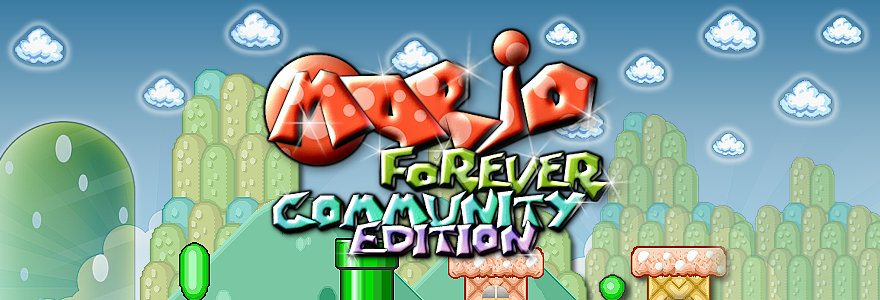

<p align="center">
  
</p>

# Mario Forever: Community Edition

[![Godot][godot-img]][godot-link]
[![License][license-img]](LICENSE.txt)
[![Discord][discord-img]][discord-link]

由 Buziol Games 制作的 [Mario Forever][mf-wiki] 社区重制版，基于 [Godot 4][godot-link] 和 [Thunder Engine](https://github.com/Thunder-Engine-Dev/thunder-engine) 重新构建。

由 [Meteo Dream](https://github.com/meteo-dream/meteo-dream) 打造的免费、非商业同人项目。与任天堂（Nintendo）或 Buziol Games 没有任何关联。

## 特性

- 基于原版 Mario Forever，完整包含 World 1 至 World 8 的故事模式
- 包含原版 Mario Forever（截至 v6.0）的全部额外内容（Hardcore、Human Laboratory、Lost Map、Funny Tanks、World of Stupidity 等）
- 专家模式（Expert Mode）与附加世界（Syzxchulun Worlds、Mario Forever Flash、World U、Human Lab 2、Squario 等）
- 自定义角色皮肤，内置皮肤编辑器
- 调整菜单（Tweaks），提供还原原作体验及挑战性选项（Checkpoints、Coyote Time、不同的音乐版本、更难的主线关卡、保留进度继续游戏等等大量选项）
- 支持键盘与手柄操作
- 提供 Windows 和 Linux 构建版本

## 临时构建版

Windows 和 Linux 的临时构建版会由 GitHub Actions 工作流在每次提交时自动编译，你可以 [在这里下载](https://nx.wtf/s/2GqcQ)。这些版本不是稳定发布版。

## 从源代码运行

本项目基于 [经过修改的 **Godot 4.7.1-rc2**](https://nx.wtf/s/aVtZ?path=Software%2FGodot-TE) 构建，其中包含渲染相关的修复。如果使用其他 Godot 版本（包括官方版本），可能会遇到问题。如有需要，你也可以[自行编译该分支](https://github.com/Thunder-Engine-Dev/godot-te/tree/4.7)。

Thunder Engine 以 Git 子模块的形式包含在项目中。请递归克隆：

```bash
git clone --recursive https://github.com/meteo-dream/mf-community-edition.git
cd mf-community-edition
```

如果已经在未包含子模块的情况下完成克隆：

```bash
git submodule update --init --recursive
```

在 Godot 中打开 `project.godot`，等待导入完成，然后重新加载项目（项目 -> 重新加载当前项目）。这是为了让 GDExtensions 正常加载。

存档、设置和日志会保存到 `MeteoDream/Mario Forever Community Edition`。该文件夹的位置取决于操作系统，详见 [Godot 文档](https://docs.godotengine.org/en/4.7/tutorials/io/data_paths.html#accessing-persistent-user-data-user)。如有需要，可以在项目设置（Project Settings）中修改该路径。

## 导出到 Windows 和 Linux

支持 Windows 和 Linux x86-64 导出。下载 [导出模板](https://nx.wtf/s/aVtZ?path=Software%2FGodot-TE)，然后在导出模板管理器中指定模板的位置。

选择 Windows 或 Linux 预设，点击导出项目。

### 导出到其他平台

如果希望将游戏移植到其他平台或架构，请从 [这个 Godot 分支](https://github.com/Thunder-Engine-Dev/godot-te/tree/4.7) 编译相应的发行版模板。MFCE 或任何 Thunder Engine 游戏都**不应**使用官方标准模板。

此外，还需要为目标架构编译 [音乐库](https://github.com/Thunder-Engine-Dev/godot-openmpt)，并将其添加到 [openmpt.gdextension](addons/godot-openmpt/openmpt.gdextension)。

`libleaderboards` 是 Mario Minix 排行榜使用的闭源库。请勿将其用于修改后的项目。即使没有该库，游戏也可以正常运行。

你也可以将 [MFCE 皮肤编辑器](https://github.com/meteo-dream/MFCE-skin-creator/)（Godot 4.7-stable，MIT 许可）以及 Heavenice 的 [重制 Mario 皮肤](https://github.com/meteo-dream/bundled-mfce-skins) 集成到项目中。

## 自定义引擎

不要直接修改 `engine/` 中的文件；它是一个子模块，其中的修改会在子模块更新时丢失。如果需要自定义引擎中的某些内容，请将 `engine/` 中的场景或脚本复制出来或进行扩展，并在本项目中覆盖它。如果发现引擎本身存在问题，请向 [Thunder Engine](https://github.com/Thunder-Engine-Dev/thunder-engine) 提交 Pull Request。

## 社区

- Discord：[https://discord.gg/VwgV6GmwXv](https://discord.gg/VwgV6GmwXv)
- 论坛（中文）：[https://marioforever.net](https://marioforever.net)
- 论坛（英文）：[https://marioforever.space](https://marioforever.space)
- 下载 MF 游戏：[https://download.marioforever.net/mf-games.html](https://download.marioforever.net/mf-games.html)
- Thunder Engine 文档：[README.md](https://github.com/Thunder-Engine-Dev/thunder-engine/blob/main/README.md)

## 致谢

- **Mario Forever** —— 原版游戏由 Buziol Games 制作
- **Thunder Engine** —— [Thunder Engine 贡献者](https://github.com/Thunder-Engine-Dev/thunder-engine)
- **Community Edition** —— Meteo Dream 及各位贡献者
- **Godot Engine** —— [godotengine.org](https://godotengine.org)

完整贡献者名单请参见游戏内的制作人员名单。

## 免责声明

马力欧（Mario）、路易吉（Luigi）以及其他任天堂角色、美术和音乐均归任天堂所有。Mario Forever 是 Buziol Games 制作的同人游戏。本项目为免费同人作品，不以盈利为目的。禁止将本项目用于商业用途。

## 许可证

本项目采用一个 [非商业同人项目许可证](LICENSE.txt)。不得删除许可证文本或游戏内免责声明。

**允许**，且仅限免费使用：
- 以非商业方式复制和再分发本软件
- 发布修改后的版本
- 将游戏移植到其他平台

**不允许：**
- 以商业方式分发本软件的副本，无论是否经过修改（所有副本都必须免费提供）
- 删除本许可证或免责声明
- 未经 Meteo Dream 明确书面许可，声称本软件为自己创作

随附的大部分图像、音乐、音效、角色以及原版 Mario Forever 关卡均属于**衍生作品**。任天堂 IP 仍归任天堂所有。Mario Forever 的相关内容仍归 Buziol Games 所有。Squario、Mario Forever Flash、Syzxchulun 世界和 World U 等移植作品仍归其原作者所有。完整的资产分类请参见 [LICENSE](LICENSE.txt)。


`engine/` 子模块源代码采用 [BSD 2-Clause License](engine/LICENSE) 授权。该许可证**不适用于**随引擎附带的任天堂角色、名称、图像、音乐以及任何基于这些内容制作的内容；这些内容仍归任天堂所有。详见 [engine/LICENSE](engine/LICENSE) 和 [engine/README.md](engine/README.md)。

[godot-img]: https://img.shields.io/badge/Godot-4.7-478cbf?logo=godot-engine&logoColor=white
[godot-link]: https://godotengine.org
[license-img]: https://img.shields.io/badge/license-Non--Commercial-orange.svg
[discord-img-]: https://img.shields.io/badge/Discord-5865F2?logo=discord&logoColor=white
[discord-img]: https://img.shields.io/discord/818109948490809344?logo=discord&logoColor=white&color=5865F2
[discord-link]: https://discord.gg/VwgV6GmwXv
[mf-wiki]: https://zh.wiki.marioforever.net/wiki/Mario_Forever
[workflow-img]: https://img.shields.io/github/actions/workflow/status/meteo-dream/mf-community-edition/workflows%2Fgodot-ci.yml
